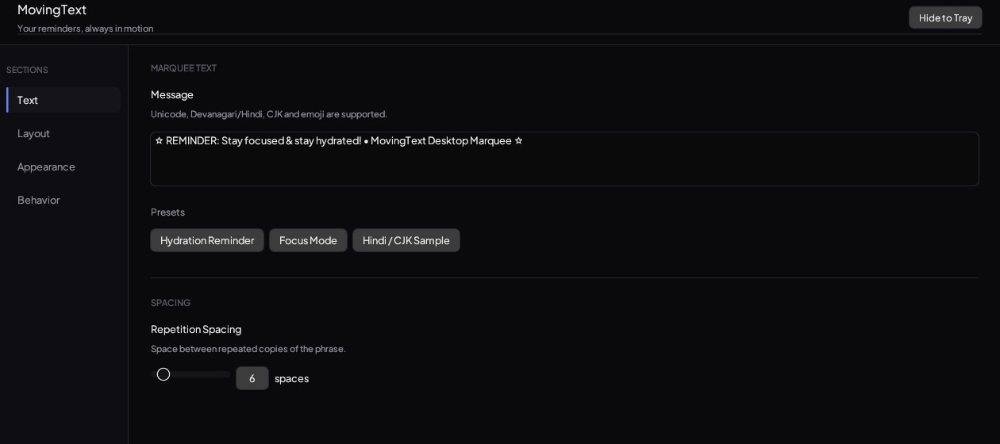

<p align="center">
  
</p>

<p align="center">
  <a href="https://github.com/imnakul/movingtext/actions/workflows/ci.yml"></a>
  <a href="LICENSE"></a>
  
  
</p>

## What it is

MovingText is a small Windows desktop utility that scrolls a text message along the edges of your screen, like an always-on-top marquee. It sits quietly at the edge of your attention: never blocking your work, never asking to be clicked, just gently repeating whatever you told it to say.

Think of it as a permanent, ambient sticky note that never leaves your screen and never gets buried under a stack of windows.

## The problem it solves

Reminders that live inside an app get closed with the app. Sticky notes on your monitor bezel do not update themselves. Calendar notifications interrupt you once and then disappear.

MovingText solves a narrower, quieter problem: keeping one short piece of text permanently and unobtrusively visible, regardless of what else is open, without stealing focus, without a popup, and without a sound.

## Who it is for

- **Knowledge workers and creatives** who want a standing reminder ("take a break", "ship the draft", "call mom") that survives switching between a dozen other windows.
- **People building focus habits** who want a visible, low-friction nudge instead of another notification to dismiss.
- **Anyone who wants a lightweight, no-account, no-cloud, fully local Windows utility.** MovingText has no network calls, no telemetry, and no login. It reads a config file and draws some text.

## Features

- Scrolling text along any combination of the top, bottom, left, and right screen edges, each independently toggled.
- Adjustable scroll speed, direction, phrase spacing, and strip thickness.
- Full font control: family, size, bold, italic, and independent text and background colors (including transparency).
- Full Unicode support, including Devanagari and Hindi, CJK scripts, and emoji.
- Configurable clearance padding per edge, so the marquee does not overlap window controls or the taskbar.
- Optional click-through mode, so the marquee never intercepts a mouse click.
- Always-on-top toggle.
- Minimizes to the system tray instead of cluttering the taskbar, with the marquee continuing to run in the background.
- Settings are saved automatically to a local JSON file. No account, no cloud sync, nothing leaves your machine.

## Screenshot

<p align="center">
  
</p>

## Installing

### Option 1: download a build

Grab the latest `movingtext-vX.Y.Z.exe` from the [Releases](../../releases) page and run it. No installer, no admin rights required.

### Option 2: build from source

You will need the [Rust toolchain](https://www.rust-lang.org/tools/install) (stable channel) and Windows 10 or 11.

```bash
git clone https://github.com/imnakul/movingtext.git
cd movingtext
cargo build --release
```

The compiled binary will be at `target/release/movingtext.exe`. Run it directly, no installation step needed.

## Running it

Launching `movingtext.exe` opens the settings window and starts the marquee overlay in the background. Closing the settings window (or pressing "Hide to Tray") does not quit the app: it minimizes to the system tray, and the marquee keeps running. Double-click the tray icon, or right-click it and choose "Open Settings", to bring the settings window back. Right-click the tray icon and choose "Exit Application" to actually quit.

Everything is configured from the settings window:

- **Text**: the message itself, a few quick presets, and the spacing between repeated copies of the phrase.
- **Layout**: which edges are active, strip thickness, and clearance padding.
- **Appearance**: font family, size, weight, style, and the text and background colors.
- **Behavior**: scroll speed, direction, always-on-top, and click-through mode.

A live preview strip at the bottom of the window always reflects the current settings.

## Configuration file

Settings are stored as plain JSON at:

```
%APPDATA%\movingtext\config.json
```

Deleting that file resets MovingText to its defaults on next launch.

## Platform support

MovingText is Windows-only by design. The overlay rendering is built directly on Direct2D and DirectWrite, and the tray integration and window management use the native Win32 API, so there is no cross-platform abstraction layer to maintain or to leak performance through. There are no plans to port it to macOS or Linux.

## Built with

- [Rust](https://www.rust-lang.org/)
- [egui](https://github.com/emilk/egui) and [eframe](https://github.com/emilk/egui) for the settings window
- Direct2D and DirectWrite (via the [`windows`](https://github.com/microsoft/windows-rs) crate) for the overlay rendering
- [Plus Jakarta Sans](https://fonts.google.com/specimen/Plus+Jakarta+Sans) and [Noto Sans Devanagari](https://fonts.google.com/noto/specimen/Noto+Sans+Devanagari), both licensed under the SIL Open Font License, for interface and marquee text rendering

## Contributing

Issues and pull requests are welcome. If you are proposing a larger change, please open an issue first to discuss the approach. Run `cargo fmt` and `cargo build` before submitting a pull request; CI runs both on every push.

## License

MovingText is released under the [MIT License](LICENSE). Use it, fork it, ship it.
